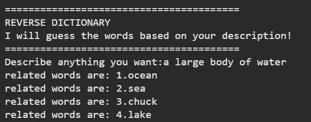

# Reverse Dictionary

A command‑line tool that takes a description and returns related words using the Datamuse API.

## Example

## How to run
1. Install Python 3.6+
2. Install `requests`: `pip install requests`
3. Run `python reversedictionary.py`
